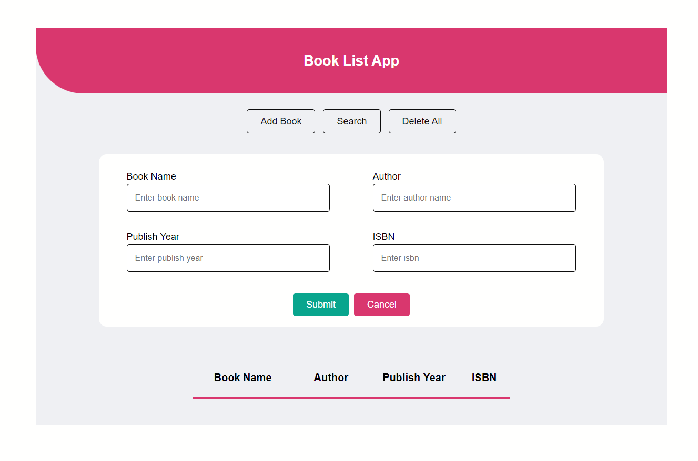

# BookListApp
#### Booklist app using HTML, CSS and JavaScript (ES5)
#### I used Local Storage to store the data in the browser.
### Main goal of implementing:
#### Practicing the creation and prototype-based inheritance of objects using ES5.
### For the live preview, click the link 👉 https://book-list-xi.vercel.app/

  

